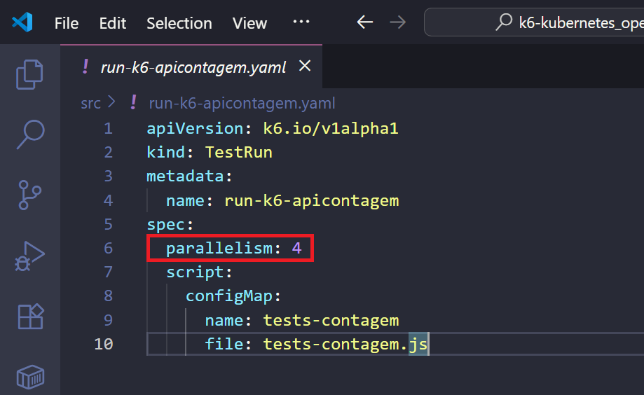

# k6-kubernetes_operator-azuredevops-loadtests_http
Exemplo de implementação de testes de carga com k6 a partir de um cluster Kubernetes, através do uso do k6 Operator e um pipeline do Azure DevOps.

## Configuração no Kubernetes

Foi realizado o deployment do Operator do k6 via Helm:

```bash
helm repo add grafana https://grafana.github.io/helm-charts
helm repo update
helm install k6-operator grafana/k6-operator
```

k6 Operator em execução:


Referências:
- [Install k6 Operator | Grafana k6](https://grafana.com/docs/k6/latest/set-up/set-up-distributed-k6/install-k6-operator/)
- [Running distributed tests | Grafana k6](https://grafana.com/docs/k6/latest/testing-guides/running-distributed-tests/)

## Pipeline

Definido o variable group **k6-kubernetes-apicontagem**, com a variável **EndpointGetTest** (endpoint de testes da API REST):


Esta configuração será aplicada no script de testes, via Replace token:


Pipeline executado com sucesso:


A imagem anterior mostra 4 jobs criados para a execução em paralelo dos testes, além de um job starter e outro initializer. Essas estruturas foram criadas com base nas definições que estão no arquivo **run-k6-apicontagem.yaml**, que corresponde a um objeto **TestRun** do k6 Operator:



Um **ConfigMap** foi criado para o arquivo com os testes:

```bash
kubectl create configmap tests-contagem --from-file $(loadTestsScript) -n $(namespaceTests)
```

E ao realizar o kubectl apply para o objeto **TestRun** o arquivo associado ao **ConfigMap** será executado:

```bash
kubectl apply -f run-k6-apicontagem.yaml -n $(namespaceTests)
```